# 🫁 AI-Powered Web-Based Early Detection and Personal Health Assistant System for Lung Cancer

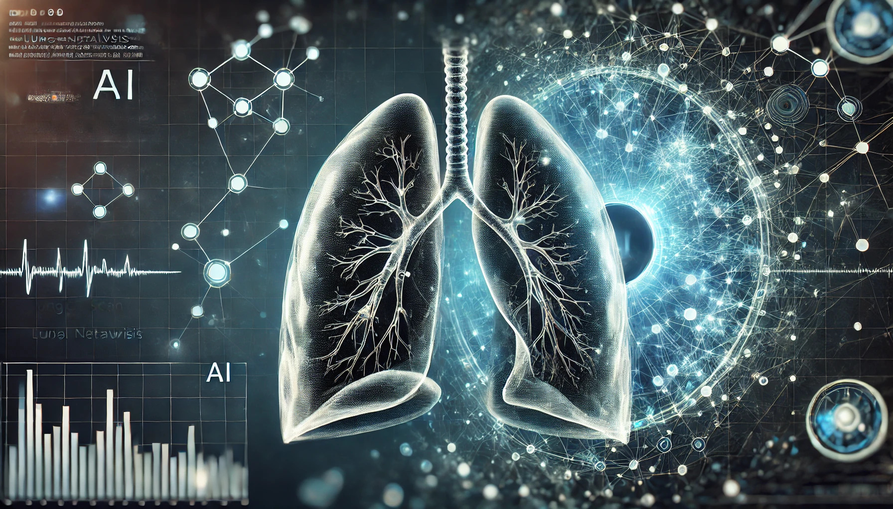  <!-- Add an image relevant to your project -->

## 📌 Project Overview
Lung cancer is one of the most common cancer types worldwide, posing a significant risk if not detected in its early stages. Computed Tomography (CT) scans play a crucial role in early diagnosis; however, manual analysis of these images can be time-consuming and exhausting for medical professionals. Moreover, the chances of effective treatment decrease if an accurate diagnosis is not made at an early stage.

This project aims to develop an AI-powered web-based system for early lung cancer detection using CT scan images. The system enhances diagnosis accuracy by leveraging deep learning models and provides interactive data analysis to better understand cancer risk factors.

---

## 📊 Global Health Statistics: Leading Causes of Death (2000-2021)

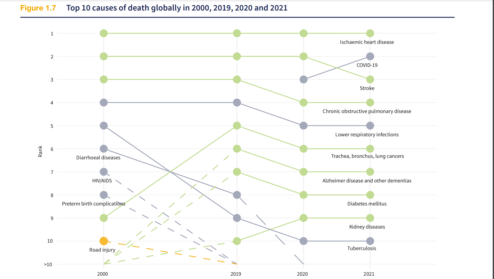
*Source: World Health Organization - World Health Statistics 2024 Report

---
## 🎯 Key Objectives

### Research Questions
- How can deep learning models be utilized to accurately classify lung cancer types using CT images?
- What are the most effective methods for integrating AI diagnostics into a user-friendly web platform?
- How can an AI-based chatbot improve patient engagement and healthcare accessibility?

### Key Steps
1. Collect and preprocess lung cancer CT image datasets.
2. Develop a deep learning-based model to classify cancer types.
3. Integrate the trained model into a web-based platform.
4. Develop a large language model (LLM)-powered chatbot to provide real-time health advice and treatment suggestions.
5. Evaluate the system’s performance and refine it based on user feedback.

   
### Problem Statement
- Manual analysis of CT images is time-consuming for medical experts
- Early-stage detection is crucial for treatment success
- Need for efficient and accurate diagnostic support tools

### Solution
Development of an AI-powered web-based system that:
- Analyzes CT images for early lung cancer detection
- Provides detailed patient data analysis
- Offers AI-driven treatment recommendations
- Includes a specialized healthcare chatbot

---

## 🌍 Sustainable Development Goals (SDGs)

### 🏥 SDG 3: Health and Quality of Life
> Strengthens the fight against lung cancer with early diagnosis, improves patient quality of life and accelerates the treatment process.

### 🏭 SDG 9: Industry, Innovation and Infrastructure
> Integration of artificial intelligence and deep learning technologies into the health sector enables the establishment of an innovative infrastructure.

### ⚖️ SDG 10: Reducing Inequalities
> The web-based system creates an opportunity to provide equitable health services, especially in regions with limited access to health services.

### ♻️ SDG 12: Responsible Production and Consumption
> The project encourages data-based decision-making and contributes to the more efficient use of health resources.

---

## 🛠️ Methods and Workflow

### 📂 Dataset
The dataset used in this project was sourced from the Hugging Face platform and includes four categories:
- **Adenocarcinoma**
- **Large Cell Carcinoma**
- **Normal (Non-Cancerous)**
- **Squamous Cell Carcinoma**

The system uses the following publicly available datasets:
1. [Hugging Face Lung Cancer Dataset](https://huggingface.co/datasets/dorsar/lung-cancer)

---

## 🔬 Data Preprocessing
To enhance model performance, the following preprocessing steps were applied:
- **Image Cropping**: Randomly resized images to **224x224** pixels.
- **Data Augmentation**: Applied random changes in brightness, contrast, and saturation.
- **Format Conversion**: Converted images from `PIL.Image` format to PyTorch Tensor format.
- **Normalization**: Standardized pixel values for improved model efficiency.

---

## 🧠 Model Training
Several deep learning architectures were trained and compared for performance:
- **ResNet50**
- **DenseNet121**
- **U-Net++**
- **MobileNetV2**
- **CNN (Custom Model)**
- **EfficientNet**

The model used with Fine Tuning to receive AI-supported treatment recommendations and interact with patients like an expert doctor:
- **Gemini-1.5-flash model**

### 🏆 Model Evaluation Metrics
- **Training & Validation Curves**
- **Confusion Matrices**
- **ROC Curves & AUC Scores**
- **Grad-CAM Visualizations**

After comparison, the best-performing model was integrated into the Django web application.

---

## 🌐 Web Platform
The web platform developed with Django consists of the following pages with a user-friendly interface:

### 🏠 **General Pages**
- **Homepage**: Provides an overview of the project, highlighting its purpose, key features, and impact.
- **About Us**: Details about the project team, their expertise, and the motivation behind the project.
- **FAQ**: A collection of frequently asked questions with detailed answers to help users understand the system better.
- **Contact**: A dedicated form where users can submit feedback, inquiries, or requests for further information.

### 🏥 **Pages Requiring Login**
- **Data Analysis**: Interactive dashboards and visualizations that provide insights into lung cancer diagnoses, risk factors, and trends using real-time data.
- **Health Assistant**: An AI-powered chatbot trained to provide accurate and up-to-date information about lung cancer, symptoms, prevention, and treatment options.
- **Cancer Detection**: Allows users to upload a CT scan image, enter personal and medical history details, and receive an AI-generated diagnosis along with a confidence score.
- **Prediction History**: A log of all past diagnostic results, where users can view, filter, and download previous analyses for further reference or medical consultations.
- **AI Treatment Recommendation**: A feature that generates personalized treatment plans based on the user's diagnosis, symptoms, and medical history. It includes insights on potential treatment options, lifestyle changes, and disease progression tracking.

📌 **Cancer Detection Page**
 
   Users can get a diagnosis by entering the following information:
- CT Image (Required field)
- Personal Information (Required field)
- Smoking Information
- Past Lung Diseases
- Occupational Exposure
- Symptoms (shortness of breath, weight loss, chronic cough, etc.)

📌 **AI Treatment Recommendation Page**,

   Based on the diagnosis, 
   
- **1. Provides patient-specific treatment options**.

- **2. Makes a comparison with the symptoms and signs** of similar patients.

- **3. Explains the diagnosis methods of the disease and the processes to be followed**.

- **4. Provides information about recommended lifestyle changes**.

- The user can download or share the generated report.

📌 **Health Assistant Page**
- The chatbot provides answers like a chest disease specialist.

- Provides scientific and up-to-date information.
- Does not make a definitive diagnosis and does not recommend medication.
- Directs the user to a healthcare institution.

---

## 📌 **Data Analysis & Visualization Page**
📊 Interactive analyses were performed with data collected from users. Graphs created using **Plotly**:
- **Historical Change in Cancer Prediction Results**
- **Confidence Score Distribution**
- **Gender Distribution and Prediction Results**
- **Age Distribution and Prediction Results**
- **Smoking Rate and Prediction Results**
- **Symptom Distribution and Prediction Results**
- **Occupational Exposure and Prediction Results**

These analyses are updated in **real time** with each new prediction made by the system.

---

## 🎛️ Admin Panel
A dedicated admin panel is included for managing:
- User data
- Prediction history
- AI assistant interactions
- System configurations

---

## ⚙️ Technologies & Libraries Used
- **Backend**: Django 5.1.6
- **Deep Learning**: PyTorch 2.6.0, TorchVision 0.21.0
- **Data Processing**: Pandas 2.2.3, NumPy 2.2.2, Pillow 11.1.0
- **Visualization**: Plotly 6.0.0, seaborn 0.3.12, matplotlib 3.10.0
- **Environment Variables**: Python-dotenv 1.0.1
- **Generative AI**: Google-GenerativeAI 0.8.4
- **Admin Dashboard**: Django-Jazmin 3.0.1

---

## 📷 Screenshots
### 1. **cancer Detection**
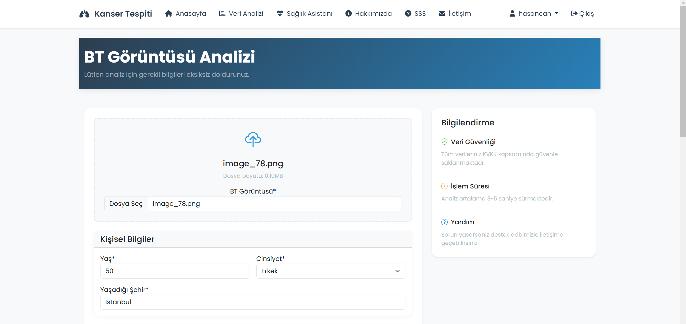

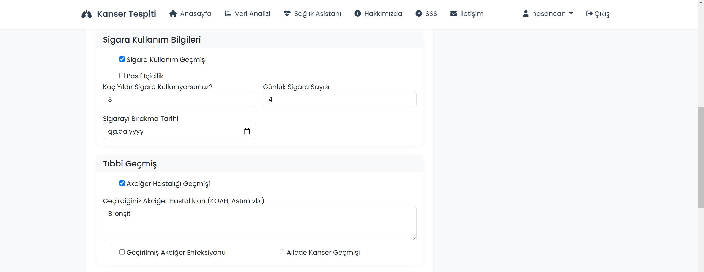

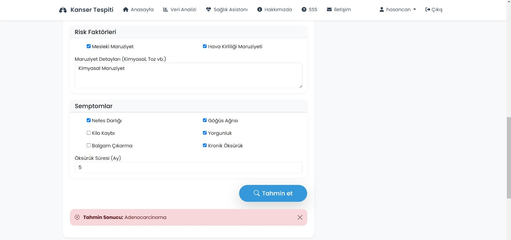
### 2. **Prediction History**
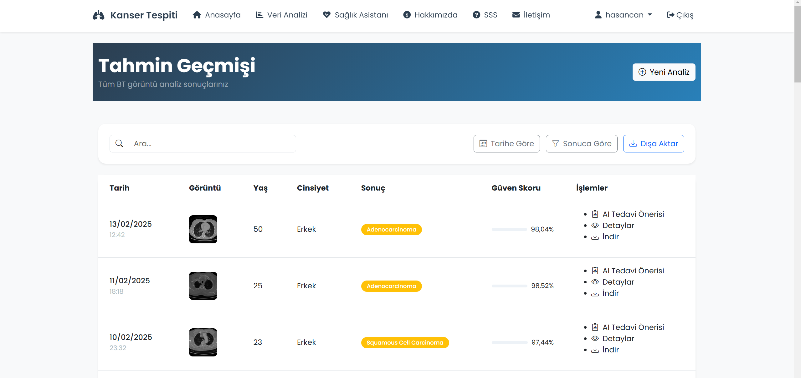
### 3. **Prediction Detail**
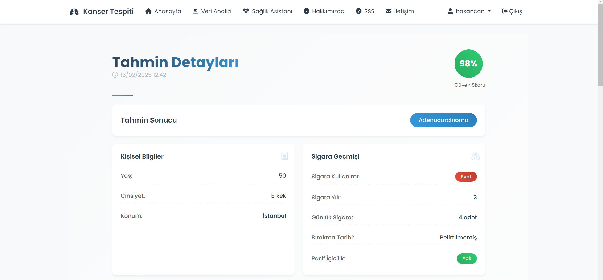

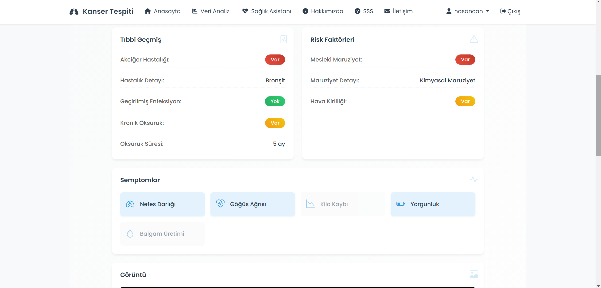
### 4. **Treatment Recommendation**
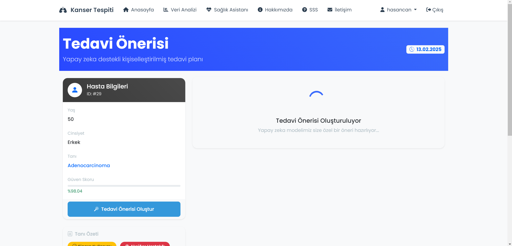

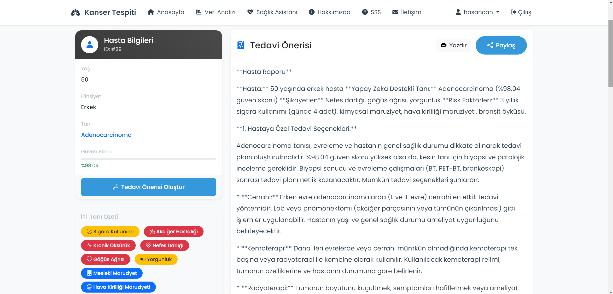
### 5. **Analysis Dashboard**
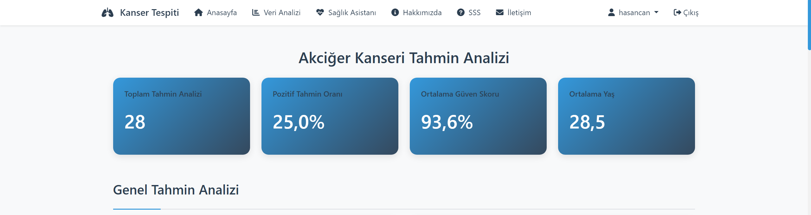

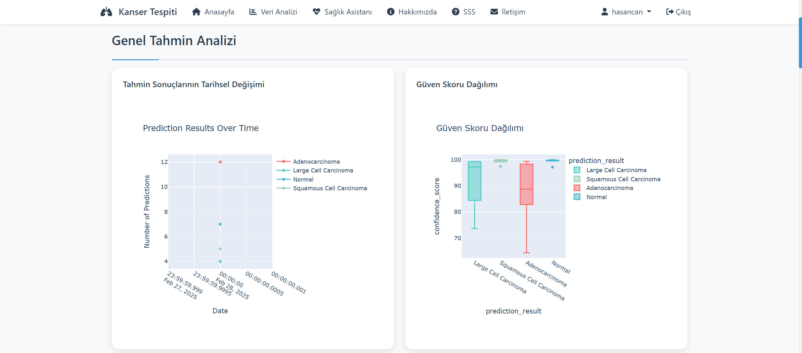

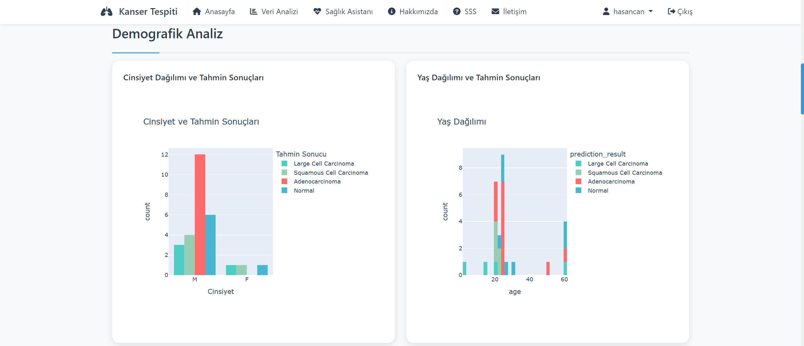

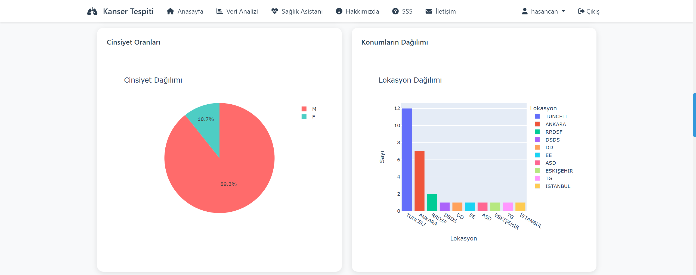

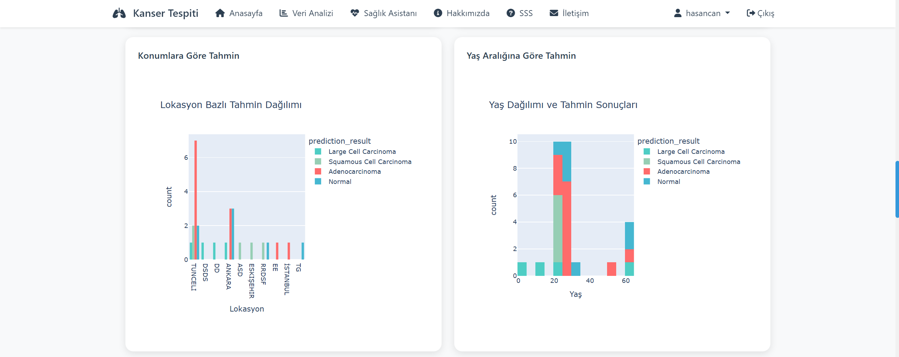

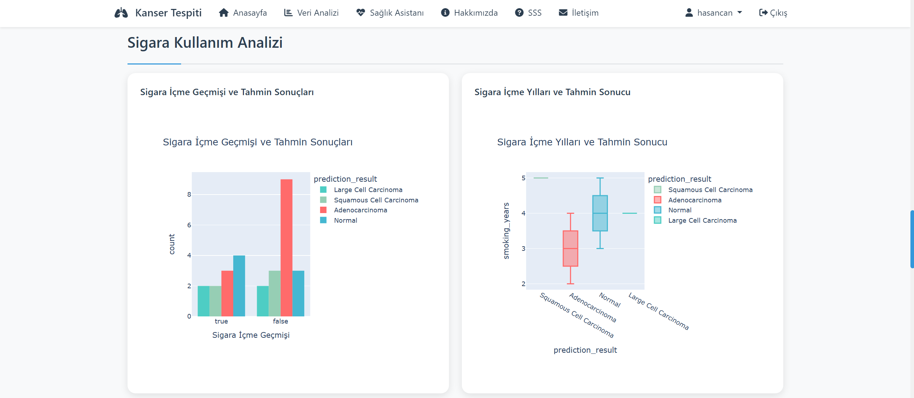

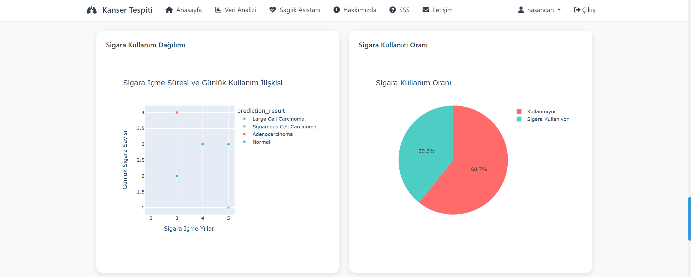

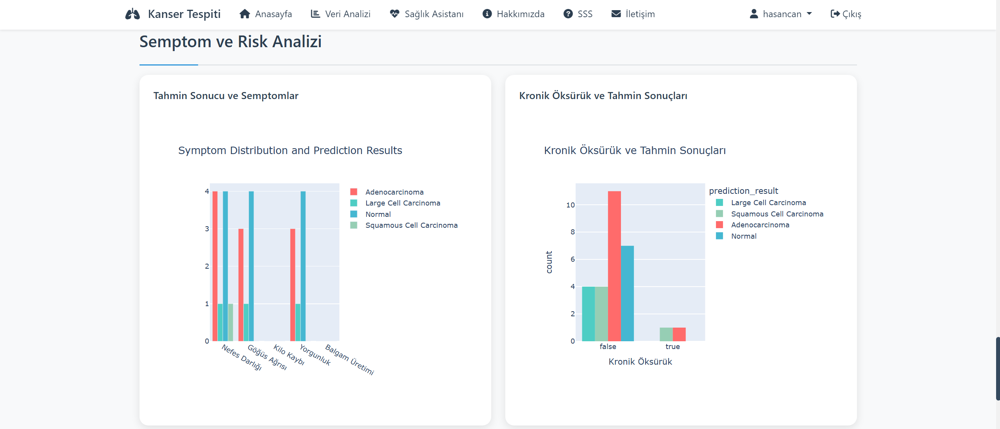

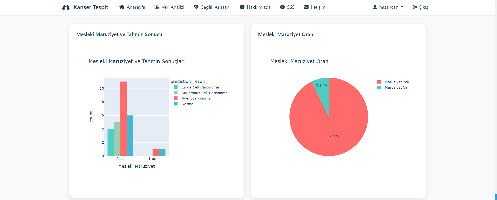
### 6. **AI Health Assistant**
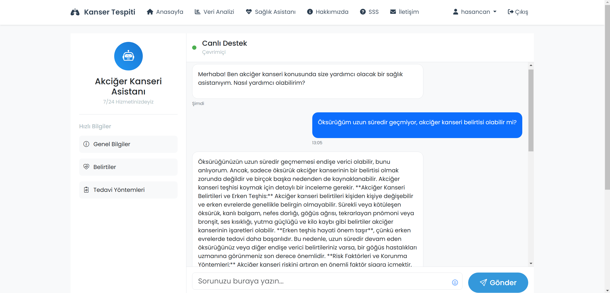

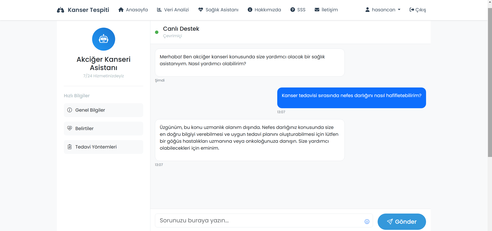

### 7. **Admin Panel**
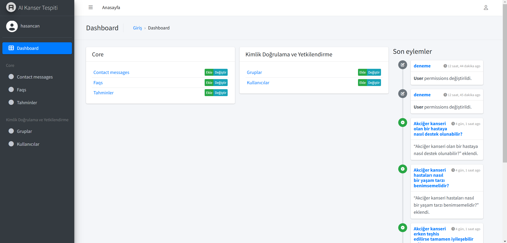
---

## 📬 Contact
👨‍💻 Developed by and Project owner:**  Hasan Can Çelik ([GitHub](https://github.com/HasanCan6241))  

If you have any questions or suggestions, feel free to reach out!
- **Email**: hasancancelik6241@gmail.com
- **GitHub**: [Your GitHub](https://github.com/HasanCan6241)

---

## 📺 Project Demo

For a detailed walkthrough of the system's features and functionality, check out our demo video on YouTube.

## 🚀 Deliverables

- A **fully functional web-based platform** for lung cancer detection and management.
- An **AI-powered chatbot** for real-time health advice and patient interaction.
- **Detailed reports** for healthcare professionals to analyze trends and patient data.
- Comprehensive **documentation** including user guides and technical manuals.

© 2024 Advanced Lung Cancer Detection System. All rights reserved.

⭐ This project represents a significant advancement in medical imaging analysis and diagnostic support systems.
