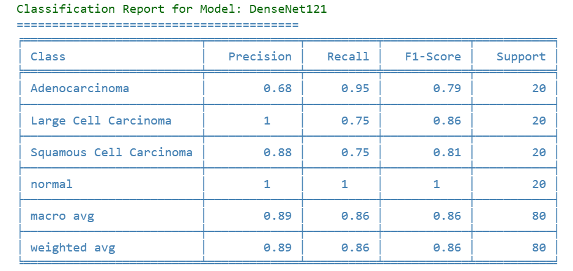
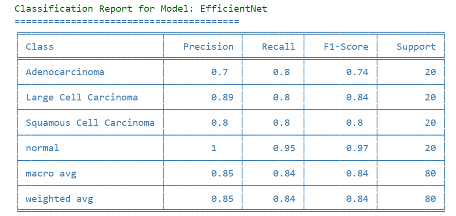
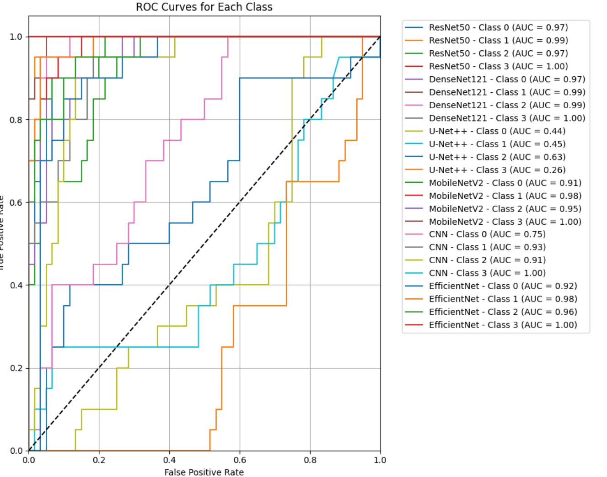

# Model Card for Artificial Intelligence-Assisted Web-Based Lung Cancer Early Detection and Treatment Planning

## 🚀 Model Summary
A comprehensive deep learning-based system for lung cancer detection and classification using CT scan images. The system incorporates multiple deep learning architectures (ResNet50, DenseNet121, EfficientNet, MobileNetV2, CNN, U-Net++) for comparative analysis, with ResNet50 emerging as the best-performing model. The system is integrated into a web-based platform with additional features including treatment recommendations using Gemini-1.5 flash model and a healthcare chatbot assistant.


## 🏗 Model Details

- **👨‍💻 Developed by:**  Hasan Can Çelik ([GitHub](https://github.com/HasanCan6241))  
- ** 📅 Model date:** February 2025
- ** 🧠 Model type:** 
  - ⚙️Deep Learning Classification Models (Ensemble)
  - 🤖Large Language Model (Gemini-1.5 flash)
- **💻Language(s):** Python
- **🏆Primary Models:** 
  - ResNet50 (Best performing image classification)
  - DenseNet121
  - EfficientNet
  - MobileNetV2
  - Custom CNN
  - U-Net++
  - **Finetuned from model:** - Gemini-1.5 flash (Treatment recommendation)


Each model was fine-tuned for the specific task of classifying lung CT scans into four categories: Adenocarcinoma, Large Cell Carcinoma, Normal Lung Tissue, and Squamous Cell Carcinoma.

## 🎯Uses

### ✅ Direct Use  
-  Primary use case is the classification of lung CT scan images into four categories
-  Intended users are healthcare professionals and medical institutions
-  The system provides both classification results and interpretability through GradCAM visualizations
-  Integrated web interface for easy access and use

### 🔗 Downstream Use 
- Treatment recommendation system using Gemini-1.5 flash model
- Patient-doctor communication through healthcare chatbot
- Integration with existing healthcare systems
- Research and educational purposes in medical institutions

### ❌ Out-of-Scope Use  
- Should not be used as the sole diagnostic tool
- Not intended for non-medical or commercial applications
- Not suitable for processing non-CT scan images
- Should not replace professional medical opinion

## ⚠️ Bias, Risks, and Limitations
- Model performance may vary across different CT scan equipment and imaging protocols
- Limited to four specific categories of lung conditions
- Training data may not represent all possible variations in lung cancer presentations
- Performance may vary across different demographic groups based on training data representation

### 🔹 Recommendations
- ✔️ Use as a supporting tool alongside professional medical diagnosis
- ✔️ Regular model monitoring and retraining with new data
- ✔️ Maintain clear communication about the system's limitations to end-users
- ✔️ Implement proper security measures for handling medical data

## 🔬 Training Details

### 📂 Dataset Composition  
- 📷 **Total Images:** 767  
  - 🟢 Adenocarcinoma: **223** (100 training, 100 test, 23 validation)  
  - 🔴 Large Cell Carcinoma: **172** (100 training, 51 test, 21 validation)  
  - ⚪ Normal Lung Tissue: **167** (100 training, 54 test, 13 validation)  
  - 🟠 Squamous Cell Carcinoma: **205** (100 training, 90 test, 15 validation)  

### Training Procedure

#### Preprocessing
Image transformations for training:
```python
transforms.Compose([
    transforms.RandomResizedCrop(224),
    transforms.RandomHorizontalFlip(),
    transforms.RandomRotation(10),
    transforms.ColorJitter(brightness=0.2, contrast=0.2, saturation=0.2),
    transforms.ToTensor(),
    transforms.Normalize(mean=[0.485, 0.456, 0.406], std=[0.229, 0.224, 0.225])
])
```

### 🔧 Training Hyperparameters  
- 🚀 Training regime: **Mixed precision (FP32/FP16)**  
- 📈 Optimizer: **Adam**  
- ⚙️ Learning rates: **1e-5 (backbone), 1e-4 (FC layers)**  
- ⚖️ Weight decay: **1e-6**  
- 🔄 Epochs: **60**  


### 💻 Compute Infrastructure  
- 🖥 **Hardware:** Google Colab **L4 GPU**  
- 🔥 **Framework:** PyTorch  


## Model Architectures

### ResNet50 Architecture
```python
class ResNetLungCancer(nn.Module):
    def __init__(self, num_classes, use_pretrained=True):
        super(ResNetLungCancer, self).__init__()
        if use_pretrained:
            weights = ResNet50_Weights.IMAGENET1K_V1
        else:
            weights = None

        self.resnet = resnet50(weights=weights)
        num_ftrs = self.resnet.fc.in_features
        self.resnet.fc = nn.Identity()

        self.fc = nn.Sequential(
            nn.Linear(num_ftrs, 256),
            nn.ReLU(),
            nn.Dropout(0.7),
            nn.Linear(256, num_classes)
        )

    def forward(self, x):
        x = self.resnet(x)
        return self.fc(x)
```


    
### DenseNet121 Architecture
```python
class DenseNetLungCancer(nn.Module):
    def __init__(self, num_classes, use_pretrained=True):
        super(DenseNetLungCancer, self).__init__()
        if use_pretrained:
            weights = DenseNet121_Weights.IMAGENET1K_V1
        else:
            weights = None

        self.densenet = densenet121(weights=weights)
        num_ftrs = self.densenet.classifier.in_features
        self.densenet.classifier = nn.Identity()

        self.fc = nn.Sequential(
            nn.Linear(num_ftrs, 256),
            nn.ReLU(),
            nn.Dropout(0.5),
            nn.Linear(256, num_classes)
        )

    def forward(self, x):
        x = self.densenet(x)
        return self.fc(x)
```


### EfficientNet Architecture
```python
class EfficientNetLungCancer(nn.Module):
    def __init__(self, num_classes, use_pretrained=True):
        super(EfficientNetLungCancer, self).__init__()
        if use_pretrained:
            self.efficientnet = models.efficientnet_b0(weights=models.EfficientNet_B0_Weights.IMAGENET1K_V1)
        else:
            self.efficientnet = models.efficientnet_b0(weights=None)

        num_ftrs = self.efficientnet.classifier[1].in_features
        self.efficientnet.classifier = nn.Identity()

        self.fc = nn.Sequential(
            nn.Linear(num_ftrs, 256),
            nn.ReLU(),
            nn.Dropout(0.7),
            nn.Linear(256, num_classes)
        )

    def forward(self, x):
        x = self.efficientnet(x)
        return self.fc(x)
```

### MobileNetV2 Architecture
```python
class MobileNetV2LungCancer(nn.Module):
    def __init__(self, num_classes, use_pretrained=True):
        super(MobileNetV2LungCancer, self).__init__()
        if use_pretrained:
            self.mobilenet = models.mobilenet_v2(weights=models.MobileNet_V2_Weights.IMAGENET1K_V1)
        else:
            self.mobilenet = models.mobilenet_v2(weights=None)

        num_ftrs = self.mobilenet.classifier[1].in_features
        self.mobilenet.classifier = nn.Identity()

        self.fc = nn.Sequential(
            nn.Linear(num_ftrs, 256),
            nn.ReLU(),
            nn.Dropout(0.7),
            nn.Linear(256, num_classes)
        )

    def forward(self, x):
        x = self.mobilenet(x)
        return self.fc(x)
```

  
### Custom CNN Architecture
```python
class SimpleCNN(nn.Module):
    def __init__(self, num_classes):
        super(SimpleCNN, self).__init__()
        self.features = nn.Sequential(
            nn.Conv2d(3, 64, kernel_size=3, padding=1),
            nn.ReLU(),
            nn.MaxPool2d(kernel_size=2, stride=2),

            nn.Conv2d(64, 128, kernel_size=3, padding=1),
            nn.ReLU(),
            nn.MaxPool2d(kernel_size=2, stride=2),

            nn.Conv2d(128, 256, kernel_size=3, padding=1),
            nn.ReLU(),
            nn.MaxPool2d(kernel_size=2, stride=2),

            nn.Conv2d(256, 512, kernel_size=3, padding=1),
            nn.ReLU(),
            nn.MaxPool2d(kernel_size=2, stride=2),
        )

        self.classifier = nn.Sequential(
            nn.Linear(512 * 14 * 14, 512),
            nn.ReLU(),
            nn.Dropout(0.5),
            nn.Linear(512, num_classes)
        )

    def forward(self, x):
        x = self.features(x)
        x = x.view(x.size(0), -1)
        x = self.classifier(x)
        return x
```


### U-Net++ Architecture
```python
class UNetPlusPlus(nn.Module):
    def __init__(self, num_classes):
        super(UNetPlusPlus, self).__init__()

        self.enc1 = self._make_encoder_block(3, 64)
        self.enc2 = self._make_encoder_block(64, 128)
        self.enc3 = self._make_encoder_block(128, 256)
        self.enc4 = self._make_encoder_block(256, 512)

        self.dec1 = self._make_decoder_block(512, 256)
        self.dec2 = self._make_decoder_block(256, 128)
        self.dec3 = self._make_decoder_block(128, 64)

        self.skip1 = self._make_se_block(64)
        self.skip2 = self._make_se_block(128)
        self.skip3 = self._make_se_block(256)

        self.avgpool = nn.AdaptiveAvgPool2d((1, 1))
        self.classifier = nn.Sequential(
            nn.Linear(64, 256),
            nn.ReLU(),
            nn.Dropout(0.2),
            nn.Linear(256, num_classes)
        )

    def _make_encoder_block(self, in_channels, out_channels):
        return nn.Sequential(
            nn.Conv2d(in_channels, out_channels, 3, padding=1),
            nn.BatchNorm2d(out_channels),
            nn.ReLU(inplace=True),
            nn.Conv2d(out_channels, out_channels, 3, padding=1),
            nn.BatchNorm2d(out_channels),
            nn.ReLU(inplace=True),
            nn.MaxPool2d(2, 2)
        )

    def _make_decoder_block(self, in_channels, out_channels):
        return nn.Sequential(
            nn.ConvTranspose2d(in_channels, out_channels, 2, stride=2),
            nn.Conv2d(out_channels, out_channels, 3, padding=1),
            nn.BatchNorm2d(out_channels),
            nn.ReLU(inplace=True),
            nn.Conv2d(out_channels, out_channels, 3, padding=1),
            nn.BatchNorm2d(out_channels),
            nn.ReLU(inplace=True)
        )

    def _make_se_block(self, channels, reduction=16):
        return nn.Sequential(
            nn.AdaptiveAvgPool2d(1),
            nn.Conv2d(channels, channels // reduction, 1, bias=False),
            nn.ReLU(inplace=True),
            nn.Conv2d(channels // reduction, channels, 1, bias=False),
            nn.Sigmoid()
        )

    def forward(self, x):
        e1 = self.enc1(x)
        e2 = self.enc2(e1)
        e3 = self.enc3(e2)
        e4 = self.enc4(e3)

        d1 = self.dec1(e4) + self.skip3(e3) * e3
        d2 = self.dec2(d1) + self.skip2(e2) * e2
        d3 = self.dec3(d2) + self.skip1(e1) * e1

        x = self.avgpool(d3)
        x = torch.flatten(x, 1)
        x = self.classifier(x)
        return x
```

## Model Evaluation

### Final Performance Results
1. ResNet50
   - Training Accuracy: 91.58%
   - Validation Accuracy: 84.72%
   - Training Loss: 0.2129
   - Validation Loss: 0.3995

2. DenseNet121
   - Training Accuracy: 90.58%
   - Validation Accuracy: 88.89%
   - Training Loss: 0.2862
   - Validation Loss: 0.3944

3. EfficientNet
   - Training Accuracy: 81.56%
   - Validation Accuracy: 70.83%
   - Training Loss: 0.4061
   - Validation Loss: 0.6358

4. MobileNetV2
   - Training Accuracy: 78.16%
   - Validation Accuracy: 59.72%
   - Training Loss: 0.5356
   - Validation Loss: 0.8412

5. Custom CNN
   - Training Accuracy: 65.73%
   - Validation Accuracy: 50.00%
   - Training Loss: 0.7522
   - Validation Loss: 1.0099

6. U-Net++
   - Training Accuracy: 59.52%
   - Validation Accuracy: 38.89%
   - Training Loss: 0.8416
   - Validation Loss: 1.0069

## 📊 Evaluation Results  

### 🏆 **Final Model Performance (ResNet50)**  
- ✅ **Training Accuracy:** **91.58%**  
- 🎯 **Validation Accuracy:** **84.72%**  
- 📉 **Training Loss:** **0.2129**  
- ⚠️ **Validation Loss:** **0.3995**  


### Model Performance Ranking
1. ResNet50 (Best performing)
2. DenseNet121
3. EfficientNet
4. MobileNetV2
5. Custom CNN
6. U-Net++
  
## 📈 Comparison of Trained Models
For each model, the following evaluation metrics were calculated:
- 🎯 **Precision, Recall, and F1-Score** for each class  
- 🏥 **Confusion matrices**  
- 🔍 **ROC curves & micro-average ROC curves**  
- 🖼 **GradCAM visualizations for model interpretability**


### Training and Validation Curves
The loss and accuracy values ​​in the training and validation stages for each model were plotted on a graph. These graphs help us understand whether the model is overfitting or underfitting.


### Model Evaluation Metrics
The following evaluation metrics were calculated for each model:

#### **Resnet50**


#### **DenseNet121**


#### **EfficientNet**


#### **U-Net++**


#### **CNN**


#### **MobileNetV2**


### Confusion Matrices
Confusion matrices were created to evaluate the prediction performance of each model in detail. These matrices helped us analyze which classes the models made mistakes in by visualizing their incorrect and correct classifications.

#### **Resnet50**


#### **DenseNet121**


#### **EfficientNet**


#### **U-Net++**


#### **CNN**


#### **MobileNetV2**


### ROC Curves and AUC Values
ROC curves were plotted for all models and micro-average ROC curves were also added to the graph. These graphs allowed us to visualize the overall accuracy and discrimination abilities of the models.

#### ROC Curves for Each Class



### Micro-Average ROC Curves


### Grad-CAM Visualizations
For each model, the Grad-CAM method was used to visualize the regions over which the classification decisions were made. This provided clarity about how the models made their decisions.


#### **Resnet50**


#### **DenseNet121**


#### **EfficientNet**


#### **U-Net++**


#### **CNN**


#### **MobileNetV2**


## 🚀 Model Deployment
The best performing model (ResNet50) is deployed in a Django web application with the following features:
- User-friendly interface for CT scan upload and analysis
- Integration with Gemini-1.5 flash model for treatment recommendations
- Healthcare chatbot for patient assistance
- Secure handling of medical data and patient information

## Deployment and Usage

Example usage of the deployed model:

```python
class ResNetLungCancer(nn.Module):
    def __init__(self, num_classes, use_pretrained=True):
        super(ResNetLungCancer, self).__init__()
        if use_pretrained:
            weights = ResNet50_Weights.IMAGENET1K_V1
        else:
            weights = None

        self.resnet = resnet50(weights=weights)
        num_ftrs = self.resnet.fc.in_features
        self.resnet.fc = nn.Identity()

        self.fc = nn.Sequential(
            nn.Linear(num_ftrs, 256),
            nn.ReLU(),
            nn.Dropout(0.7),
            nn.Linear(256, num_classes)
        )

    def forward(self, x):
        x = self.resnet(x)
        return self.fc(x)

@login_required
def dashboard(request):
    prediction_result = None  # Bu, tahmin sonucu verisini tutacak

    if request.method == 'POST':
        form = PredictionForm(request.POST, request.FILES)
        if form.is_valid():
            prediction = form.save(commit=False)
            prediction.user = request.user

            # Model tahmin işlemi
            device = torch.device("cuda:0" if torch.cuda.is_available() else "cpu")
            model = ResNetLungCancer(num_classes=4)
            model.load_state_dict(torch.load('lung_cancer_model.pth', map_location=device))
            model = model.to(device)
            model.eval()

            preprocess = transforms.Compose([
                transforms.Resize(256),
                transforms.CenterCrop(224),
                transforms.ToTensor(),
                transforms.Normalize(mean=[0.485, 0.456, 0.406], std=[0.229, 0.224, 0.225])
            ])

            image = Image.open(prediction.image).convert('RGB')
            input_tensor = preprocess(image).unsqueeze(0).to(device)

            with torch.no_grad():
                output = model(input_tensor)
                probabilities = torch.nn.functional.softmax(output, dim=1)
                predicted_class = torch.argmax(output, dim=1).item()
                confidence = probabilities[0][predicted_class].item()

            class_names = ['Adenocarcinoma', 'Large Cell Carcinoma', 'Squamous Cell Carcinoma','Normal']
            prediction.prediction_result = class_names[predicted_class]
            prediction.confidence_score = confidence * 100
            prediction.save()

            prediction_result = prediction.prediction_result  # Tahmin sonucunu context'e ekle


            messages.success(request, 'Tahmin başarıyla gerçekleştirildi!')
    else:
        form = PredictionForm()
    return render(request, 'users-panel/dashboard.html', {'form': form, 'prediction_result': prediction_result})
